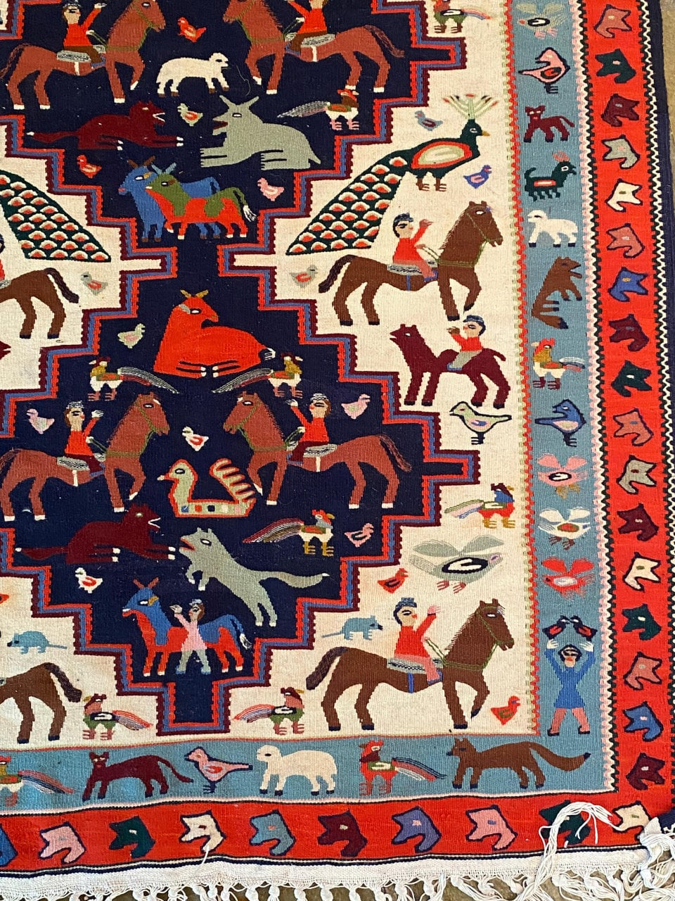
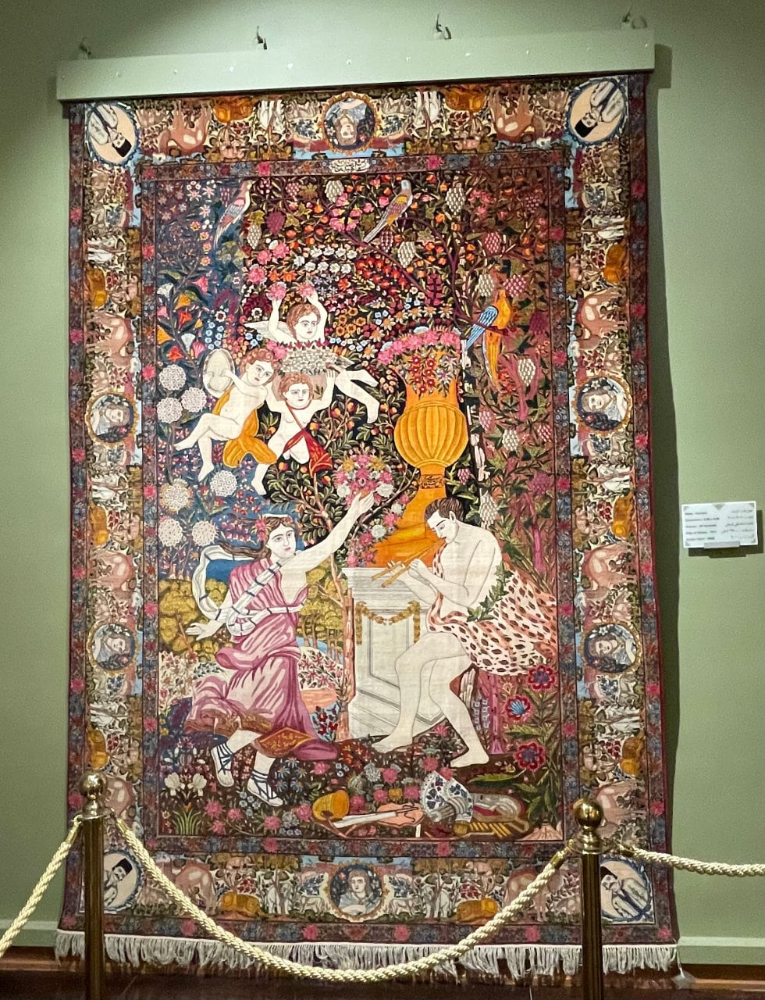
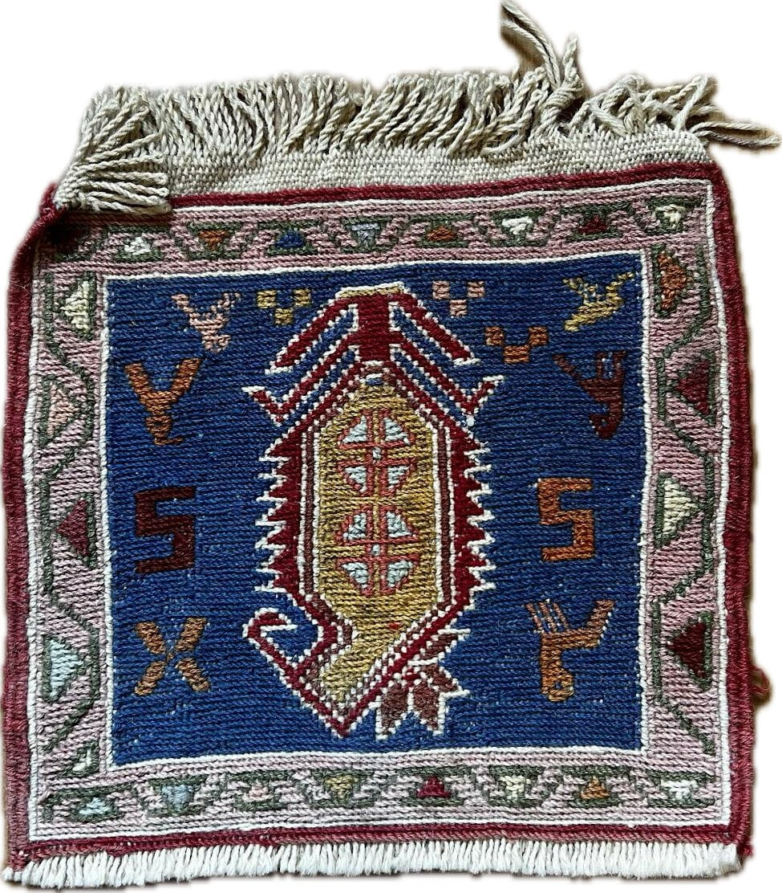
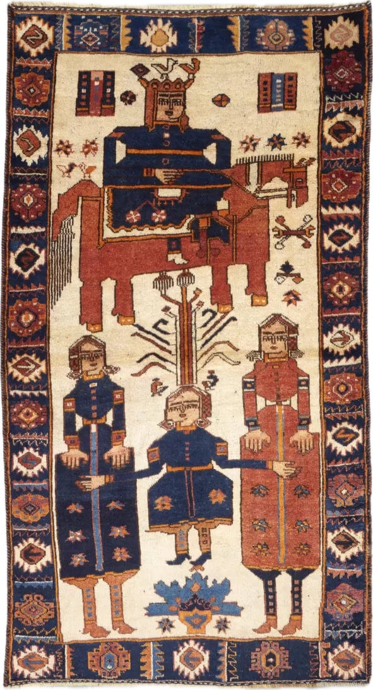
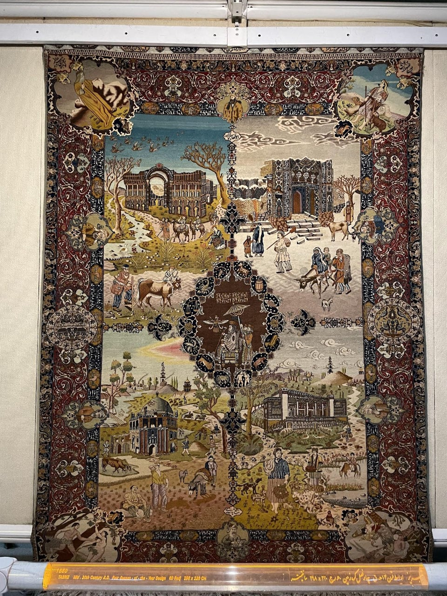
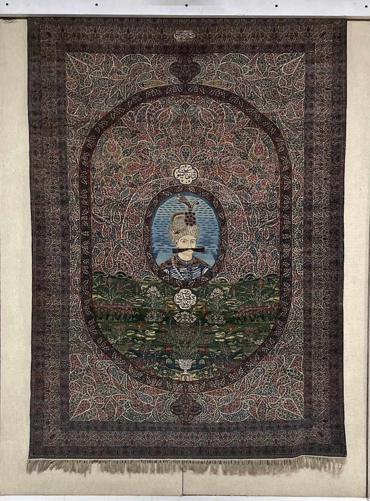
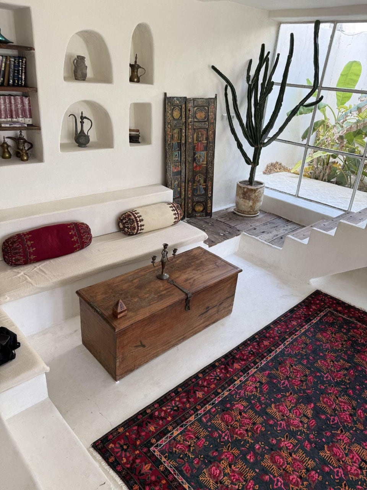
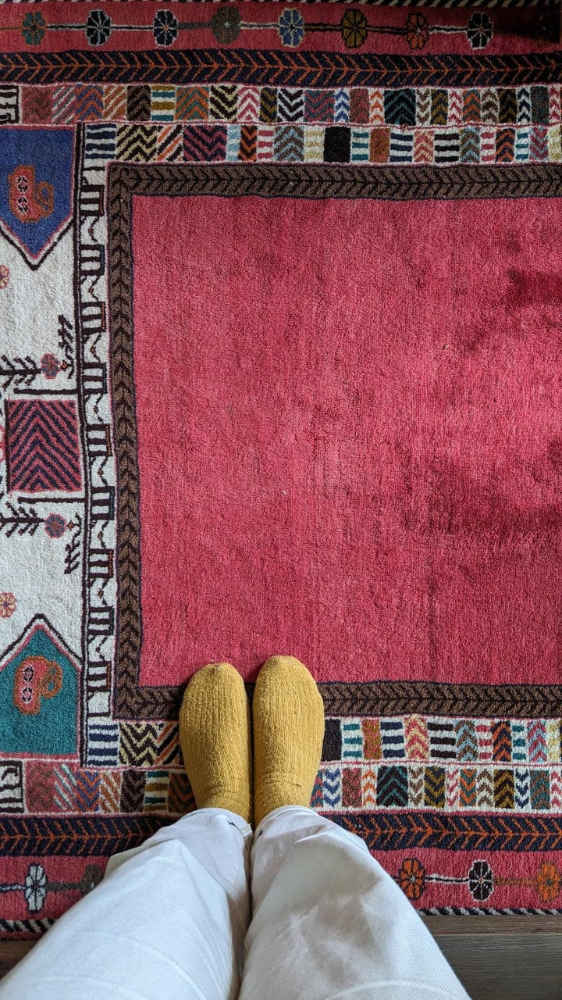

<!-- README.md is generated from README.Rmd. Please edit that file -->

```{r, include = FALSE}
knitr::opts_chunk$set(
  collapse = TRUE,
  comment = "#>",
  fig.path = "man/figures/README/fig-",
  fig.height = 1, # for palettes
  out.width = "100%"
)
```

# peRsian 

<!-- badges: start -->
<!-- badges: end -->

Hi everyone, and welcome to our package "peRsian"!

peRsian is a tribute to centuries of Persian carpet-making — a craft that's been alive for over two thousand years. It's dedicated to the incredible artisans who've kept this tradition alive: especially the women who spent countless hours knotting and weaving every single thread, and the men who sheared the sheep, dyed the wool, and prepared the yarn. Working in harmony, they transformed simple fibres into carpets rich in colour, rhythm, and life.

We've extracted colour palettes straight from our personal galleries of Persian carpets, rugs, and gabbehs, each paired with a small story of its own. They capture rich reds, deep indigos, saffron golds, and all those subtle shades in between.

Think of peRsian as a bridge between centuries of artistry and modern data visualisation — a way to add warmth, history, and humanity to your plots. Whether you're visualising a multiverse, plotting microbiome data, or just searching for a palette that feels alive, we hope peRsian brings a bit of Persian magic to your work. 🌸


## Installation

You can install the development version of peRsian from [GitHub](https://github.com/) with:

``` r
# install.packages("pak")
pak::pak("jansim/peRsian")
```

## Usage

```{r example}
library(peRsian)

names(persian_palettes)

persian_palette(names(persian_palettes)[1])
```

## ~~Palettes~~ Carpets

### Tehran


A girl in hijab standing before a Persian carpet at the Carpet Museum of Iran in Tehran (circa 2015). Much has changed since then. After months of protests, the scarf weighs a little less now — though it's not gone, not yet — it remains a weight many women still carry. That change exists because of the courage of countless Iranian women who have fought for years to claim their freedom.

Woman, Life, Freedom. Jin, Jiyan, Azadî ✌️

```{r roses}
persian_palette("tehran")
```

### Pooran



From Namin, Ardabil, this kilim tells a world in threads — animals, people, gestures, even the number of fingers carefully woven into each form. Every scene hums with life: stories of work, play, and the quiet beauty of tradition. Its details hold both the everyday and the eternal. I dedicate it to my aunt Pooran, whose life was much the same — vivid, full of movement and colour, bright with the small, human details that made her unforgettable. — Yegi

```{r pooran}
persian_palette("pooran")
```

### Fery 🐔


This vintage handwoven cushion brings new life to an antique wool rug more than half a century old, carefully restored for continued use. Persian weaving traditions are known for their durability and enduring patterns.

Our very own "Fery Hahn 🐔" brought this beautiful carpet cushion all the way from Shiraz to Munich, before it was carried even farther to New Zealand, and now, this little piece has found its home in Melbourne!


```{r medallion}
persian_palette("fery")
```

### Leyli



This carpet from the Tehran Carpet Museum feels like a celebration frozen in time. It's bursting with flowers, colour, and movement - birds in flight, children playing the "daf" (an Iranian frame drum musical instrument) and clapping, a man playing the "ney" (flute), and a woman dancing gracefully at the centre.

It's hard to tell if it's a story, a dream, or a memory, but it feels like joy woven into wool. A reminder that Persian carpets aren't just art; they're music, dance, and moments of life itself, stitched together in colour. 🎶

```{r leyli}
persian_palette("leyli")
```

### Munich


What could be a good gift for my best friend as a keepsake from Iran? Obviously, a handwoven Persian rug.

Gelim/Kilim (گلیم) is a traditional flat-woven rug made without pile, crafted by nomadic and rural weavers across Iran. Persian gelims are known for their bold geometric patterns, vivid natural dyes, and practical lightness and durability — often used as floor coverings or wall hangings.

A little piece of Shiraz is now living happily in his place in Munich. — Yegi

```{r munich}
persian_palette("munich")
```

### Isfahan



On a trip to Isfahan, Naeemeh and I wandered through Naqsh-e Jahan Square — that magical place surrounded by little shops and bazaars, full of colour and the smell of tea and saffron in the air. This tiny shop caught our eye. Inside, tucked among all the treasures, we found the smallest, most perfect little rug, a handwoven "gelim/kilim" (گلیم).

I was just about to move to Germany, and I needed something light, so I could take it with me wherever I went. A small piece of home — colourful, and full of memories. — Yegi

```{r isfahan}
persian_palette("isfahan")
```

### Hamburg


Hamburg, March. A surprisingly windless, cloudy-grey kind of day — basically, as good as it gets there. Wandering through the city's tiny side streets, suddenly Alex shouted, "Hey Yegi — a Persian carpet store!" To our surprise, it turned out to be a huge shop tucked away on the fifth floor of a building.

After nearly an hour exploring piles of carpets and rugs, a decision was made: this was the one. On the train ride back to Munich, we spread it out on one of the tables and played a deck of cards on it!!! It was a memorable ride indeed.

```{r hamburg}
persian_palette("hamburg")
```

### Hooshang



Handwoven in Hamedan, western Iran, using handspun wool and all-natural dyes. Among pictorial carpets, those depicting Hooshang Shahi hold a special place. The story of Hooshang Shah — one of the earliest tales in Ferdowsi's Shahnameh — has long captured the imagination of weavers and storytellers alike.

In the Avesta, his name appears as Heoshenge, with the epithet Pradetta, meaning "lawmaker." Hooshang is celebrated as the discoverer of fire and founder of the Sadeh Festival, remembered as the ruler of the Seven Countries, defeater of evil, and, in some traditions, the architect of Persepolis.

Photo credit: https://dyadartisans.com/shop/rugs-textiles/rugs/antique-malayer-hooshang-shah-carpet-3-6sqm/

```{r hooshang}
persian_palette("hooshang")
```

### Tabriz



This stunning carpet, called "The Four Seasons," was woven in Tabriz, one of Iran's most renowned carpet-weaving cities. Its design tells the story of the earth's four seasons — spring, summer, autumn, and winter — each woven into a corner with incredible detail and colour. There's so much happening in this piece — you can almost feel the shifting air, the warmth of summer to the chill of winter. It's as if the weavers captured not just the seasons themselves, but how people feel in them — their warmth, energy, and quiet moments of rest.

At the centre lies the Faravahar, the ancient Persian symbol associated with light, wisdom, and freedom; "good thoughts, good words, good deeds".

```{r tabriz}
persian_palette("tabriz")
```

### Abbas



At the centre sits Shah Abbas I, commonly known as Abbas the Great, the Safavid ruler whose reign in the 17th century marked one of the brightest chapters in Persian art and architecture. He's remembered for his vision, his patronage of artisans, and yes, that unmistakable moustache!

```{r abbas}
persian_palette("abbas")
```

### Reyhaneh



This carpet is a perfect example of how Persian rugs bring soul, warmth, colour, and life into the spaces we live in. In Iran, having carpets at home feels so ordinary — they're simply there, woven into everyday life. And yet, it's easy to forget how extraordinary they truly are. These pieces carry stories, hands, and history — quietly grounding us, softening our steps, and making any place feel like home.

Photo credit: Reyhaneh — taken at Lovar Villa, Qeshm (southern Iran).

```{r reyhaneh}
persian_palette("reyhaneh")
```

### Berlin



It's impossible not to pause and stare — the colours are so vibrant and full of life they almost seem to breathe. This beauty now lives with our friend in Berlin.

```{r berlin}
persian_palette("berlin")
```

### Floral (Metropolitan Museum of Art)


This fragment of a carpet bears a variety of flowers on winding stems over a blue ground. Its structure, which is composed of two planes of warp threads, indicates that it was probably produced in the city of Kirman in southeastern Iran. Carpets from this city display a wide range of patterns but are alike in construction. Exported to India during the reign of Emperor Akbar (r. 1556-1605), Kirman carpets were known to be among the finest produced in Iran during this period.

This carpet is part of the collection of the Metropolitan Museum of Art: https://www.metmuseum.org/art/collection/search/452190

```{r floral}
persian_palette("floral")
```

## Acknowledgements

A huge thank you to all friends, family and beyond who contributed the photos and images for this project. All images and photos are from personal galleries unless noted otherwise. ❤️

This package is inspired by and heavily builds upon the wonderful [{wesanderson}](https://github.com/karthik/wesanderson/) and [{MetBrewer}](https://github.com/BlakeRMills/MetBrewer/) packages.

## Gallery


