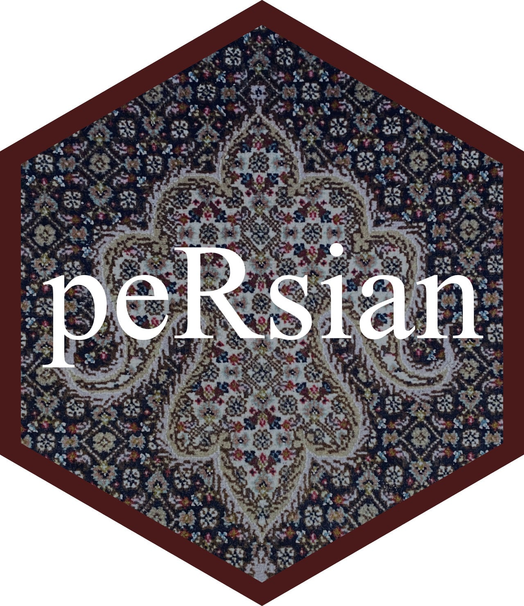
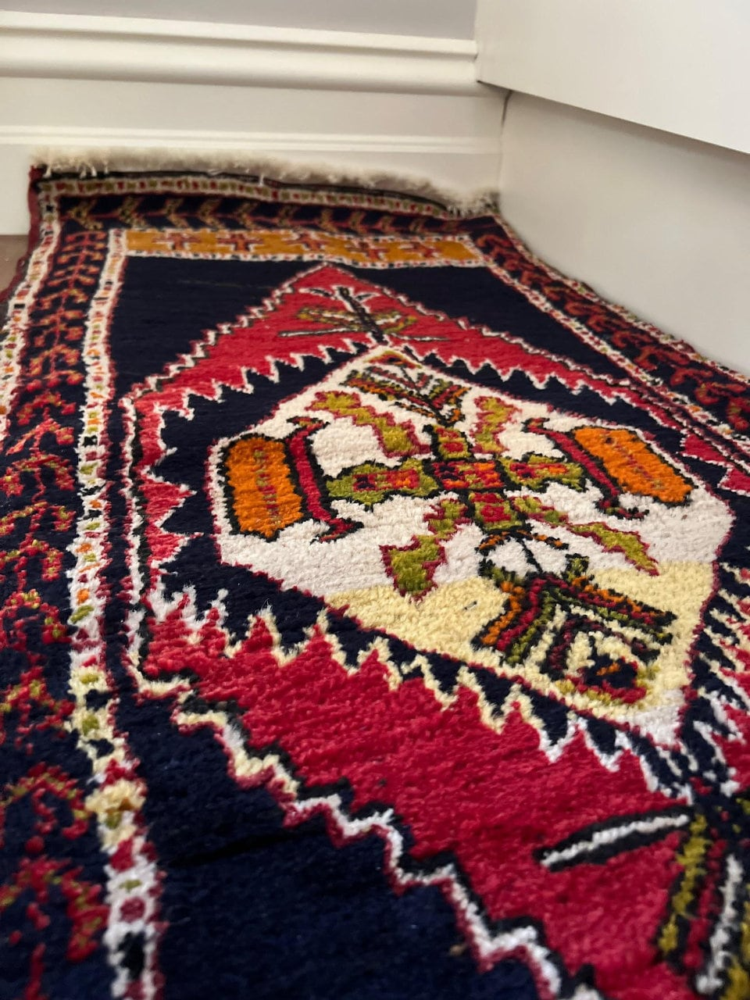
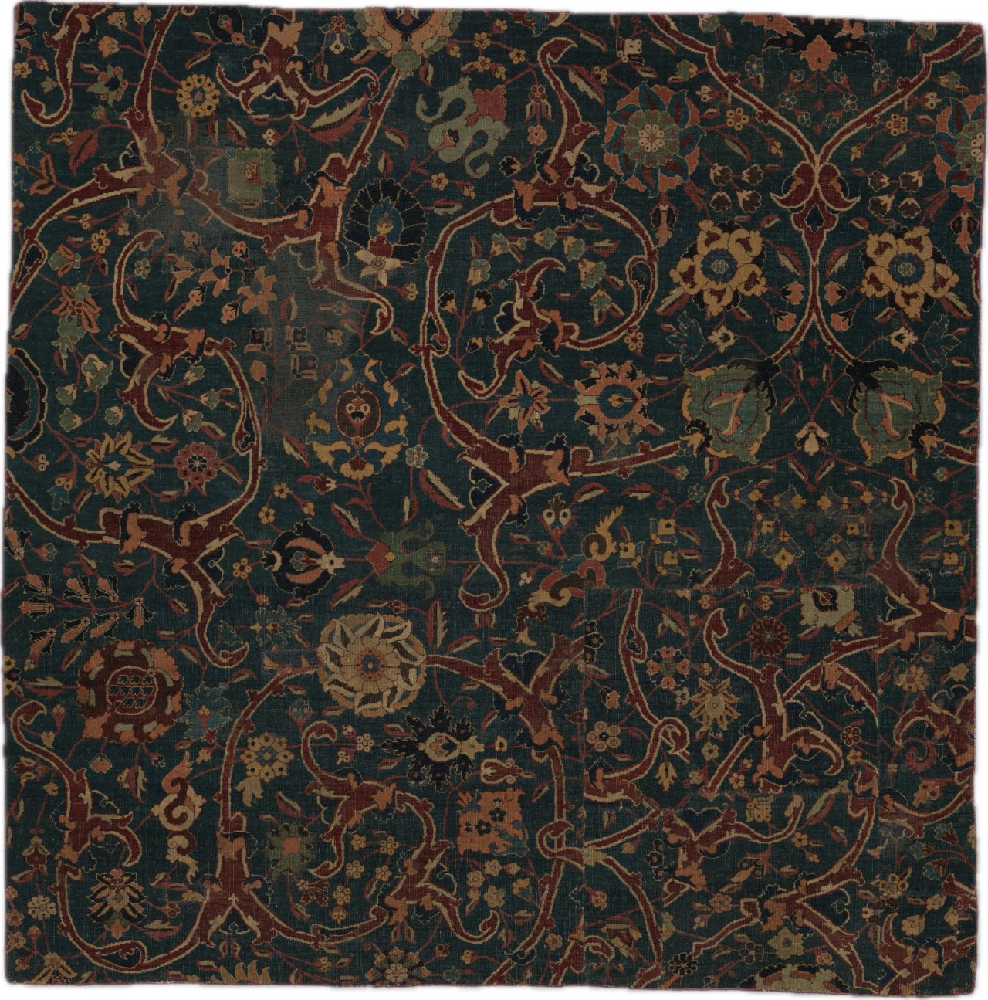

<!-- README.md is generated from README.Rmd. Please edit that file -->

```{r, include = FALSE}
knitr::opts_chunk$set(
  collapse = TRUE,
  comment = "#>",
  fig.path = "man/figures/README/fig-",
  fig.height = 1, # for palettes
  out.width = "100%"
)
```

# peRsian 

<!-- badges: start -->
<!-- badges: end -->

A collection of color palettes inspired by persian carpets.

## Installation

You can install the development version of peRsian from [GitHub](https://github.com/) with:

``` r
# install.packages("pak")
pak::pak("jansim/peRsian")
```

## Usage

```{r example}
library(peRsian)

names(persian_palettes)

persian_palette(names(persian_palettes)[1])
```

## ~~Palettes~~ Carpets

### Tehran


...


```{r roses}
persian_palette("tehran")
```

### Fery 🐔


...


```{r medallion}
persian_palette("fery")
```


### Munich


A small quadratic carpet with a rich, traditional design. The piece features a striking color palette dominated by deep navy blue, warm golden yellow, and burgundy red, with accents of white and teal.
The central motif is a large, symmetrical medallion in navy blue that resembles a stylized star or cross pattern. This central design is outlined in white and burgundy and contains smaller geometric elements within it. The medallion sits on a golden yellow background field.
Surrounding the central design is an ornate border system with multiple bands. The main border features repeating geometric patterns in burgundy red with cross-like motifs in various colors including white, teal, and yellow. The border design shows the characteristic stepped or angular patterns common in traditional carpet weaving.

```{r munich}
persian_palette("munich")
```

### Hamburg



...


```{r hamburg}
persian_palette("hamburg")
```

### Vase


This carpet overflows with naturalistically rendered flowers and plants, organized around one central medallion and four quarter- medallions in each corner. A similar medallion design can be seen on many decorative leather book covers from the same period, and it is likely that the manuscript design was incorporated into the visual repertoire of Safavid weavers. Artists working in the court atelier produced drawings and designs for artisans working in a variety of different media. The designs and trends generated by the court were then adopted by commercial workshops that created high-quality carpets like this one.

```{r vase}
persian_palette("vase")
```

https://www.metmuseum.org/art/collection/search/452187

### Floral



This fragment of a carpet bears a variety of flowers on winding stems over a blue ground. Its structure, which is composed of two planes of warp threads, indicates that it was probably produced in the city of Kirman in southeastern Iran. Carpets from this city display a wide range of patterns but are alike in construction. Exported to India during the reign of Emperor Akbar (r. 1556-1605), Kirman carpets were known to be among the finest produced in Iran during this period.

```{r floral}
persian_palette("floral")
```

https://www.metmuseum.org/art/collection/search/452190

## Gallery


## Acknowledgements

This package is inspired by and heavily builds upon the wonderful [{wesanderson}](https://github.com/karthik/wesanderson/) and [{MetBrewer}](https://github.com/BlakeRMills/MetBrewer/) packages.
